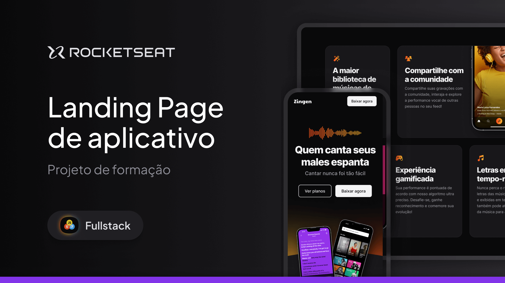

<h1 align="center">App Landing Page – Training Project</h1>

  This project is a fully responsive marketing landing page for <strong>Zingen</strong>, a karaoke app. It was developed as part of the Rocketseat Full Stack training program, serving as one of the practical exercises that integrates core web design and development concepts.

  This version, however, marks a turning point in my learning journey. After completing the initial implementation by closely following the instructor’s guidance, I realized the page didn’t render properly on my iOS device (version 15.8.4). That issue really bothered me — so I decided to rebuild the entire project from scratch to understand what was going wrong and how to fix it.

  Throughout the process, I deepened my understanding of modern CSS — especially media queries, advanced selectors, and nesting. I learned, for instance, how a single poorly written selector could affect the entire layout. That kind of detail challenged me for days until I finally nailed the solution.

  This rewrite not only fixed the layout and compatibility issues but also gave me a much stronger foundation in writing modular, scalable CSS with clear structure and purpose.

  <a href="#-technologies">Technologies</a>&nbsp;&nbsp;&nbsp;|&nbsp;&nbsp;&nbsp;
  <a href="#-project">Project</a>&nbsp;&nbsp;&nbsp;|&nbsp;&nbsp;&nbsp;
  <a href="#-layout">Layout</a>&nbsp;&nbsp;&nbsp;|&nbsp;&nbsp;&nbsp;
  <a href="#memo-license">License</a>

  

 

  

## 🚀 Technologies

This project was developed with the following technologies:

- HTML and CSS  
- Git & GitHub  
- Figma  
- Responsively App  

---

## 💻 Project

Responsive marketing landing page for Zingen, a karaoke app.

- 🔗 [Access the finished project](https://andreskull2.github.io/1-zingen/)
- 🎓 [Watch the classes](https://www.rocketseat.com.br/formacao/fullstack)

---

## 🔖 Layout

You can view the original layout via Figma:  
🔗 [Access on Figma](https://www.figma.com/community/file/1371886246180677672) *(Figma account required)*

---

## :memo: License

This project is licensed under the MIT License.

---

Made with ♥ by Rocketseat — Rebuilt with care by @andreskull2 🚀  
:wave: [Join our community!](https://discord.gg/rocketseat)
